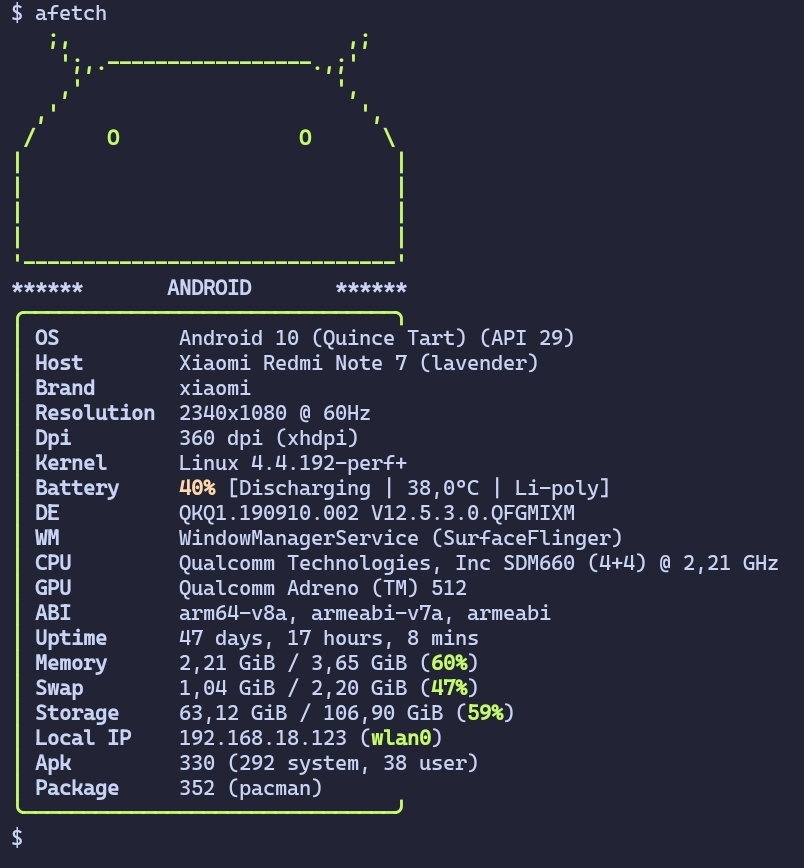

# afetch
a neofetch like tools but focused for Android (Termux)

<p align="center">
  
</p>

> [!WARNING]
> This tool still under development

## Build
first of all you need d8 if you want to build without minify or r8
if you want to build with minify and also you need a stable java compiler
then change D8/R8 variable in `config.sh` to your d8/r8 path and then
run `build.sh`.

## Configuration
you can run `afetch --cfg` for generete a configure file in `~/.config/afetch/config.json` and this is how its look like.
```json
{
  "modules": [
    {
      "type": "logo",
      "style": "medium",
      "format": "{green}{logo}{reset}"
    },
    {
      "type": "header",
      "format": "{green}╭───────────────────────────────╮{reset}"
    },
    {
      "type": "os",
      "format": "{green}│{reset} {white}OS         {reset} {os} (API {api})"
    },
    {
      "type": "host",
      "format": "{green}│{reset} {white}Host       {reset} {host}"
    },
    {
      "type": "brand",
      "format": "{green}│{reset} {white}Brand      {reset} {brand}"
    },
    {
      "type": "resolution",
      "format": "{green}│{reset} {white}Resolution {reset} {resolution}"
    },
    {
      "type": "dpi",
      "format": "{green}│{reset} {white}Dpi        {reset} {dpi}"
    },
    {
      "type": "kernel",
      "format": "{green}│{reset} {white}Kernel     {reset} Linux {kernel}"
    },
    {
      "type": "battery",
      "format": "{green}│{reset} {white}Battery    {reset} {battery}"
    },
    {
      "type": "de",
      "format": "{green}│{reset} {white}DE         {reset} {de}"
    },
    {
      "type": "wm",
      "format": "{green}│{reset} {white}WM         {reset} {wm}"
    },
    {
      "type": "cpu",
      "format": "{green}│{reset} {white}CPU        {reset} {cpu}"
    },
    {
      "type": "gpu",
      "format": "{green}│{reset} {white}GPU        {reset} {gpu}"
    },
    {
      "type": "abi",
      "format": "{green}│{reset} {white}ABI        {reset} {abi}"
    },
    {
      "type": "uptime",
      "format": "{green}│{reset} {white}Uptime     {reset} {uptime}"
    },
    {
      "type": "memory",
      "format": "{green}│{reset} {white}Memory     {reset} {memory}"
    },
    {
      "type": "swap",
      "format": "{green}│{reset} {white}Swap       {reset} {swap}"
    },
    {
      "type": "storage",
      "format": "{green}│{reset} {white}Storage    {reset} {storage}"
    },
    {
      "type": "localIP",
      "format": "{green}│{reset} {white}Local IP   {reset} {localIP}"
    },
    {
      "type": "apkCount",
      "format": "{green}│{reset} {white}Apk        {reset} {apkCount}"
    },
    {
      "type": "packageCount",
      "format": "{green}│{reset} {white}Package    {reset} {packageCount}"
    },
    {
      "type": "footer",
      "format": "{green}╰───────────────────────────────╯{reset}"
    }
  ]
}
```

## License
[MIT](./LICENSE)
